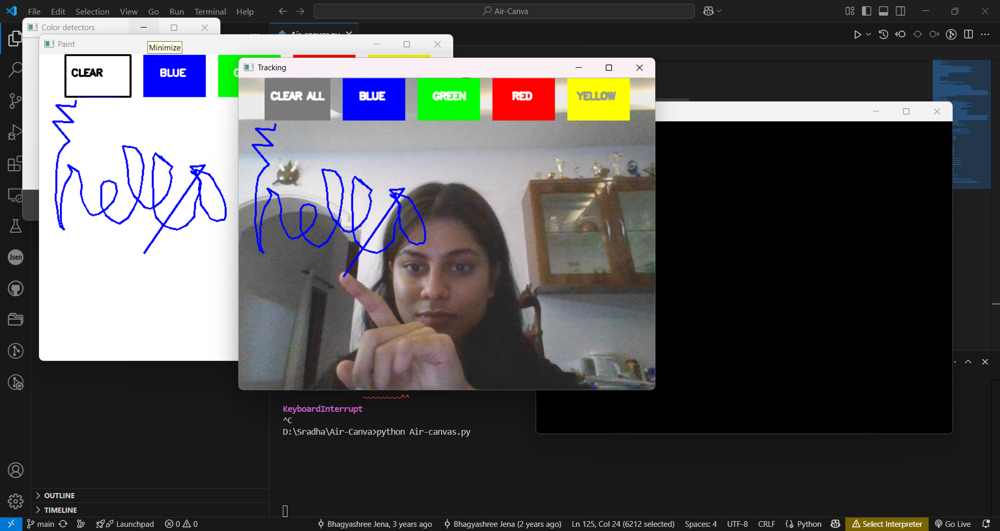

# Air Canvas

A computer vision application that enables you to draw in the air using colored object tracking.



## Overview

Air Canvas transforms your hand movements into digital drawings using computer vision techniques. With just your webcam and a colored object (like a colored pen cap or fingertip), you can create artwork by moving in front of your camera.

## Features

- **Air Drawing**: Draw by moving a colored object in front of your webcam
- **Multi-color Support**: Choose from blue, green, red, and yellow colors
- **Real-time Tracking**: Immediate visual feedback as you draw
- **Adjustable Color Detection**: Fine-tune HSV color values for optimal tracking in different lighting conditions
- **Clear Canvas Option**: Reset your drawing with a simple gesture

## Requirements

- Python 3.6+
- OpenCV
- NumPy
- Webcam

## Installation

1. Ensure you have Python installed on your system
2. Install the required packages:
   ```bash
   pip install numpy opencv-python
   ```
3. Download the `air_canvas.py` file
4. Run the application:
   ```bash
   python air_canvas.py
   ```

## How to Use

1. **Launch the application**:
   - Run the Python script to open the main interface
   - You'll see three windows: "Paint" (your canvas), "Tracking" (webcam feed), and "Color detectors" (HSV adjustment)

2. **Adjust color detection**:
   - Use the sliders in the "Color detectors" window to adjust HSV values
   - Adjust until your colored object is clearly visible in the "mask" window
   - Recommended: Use a brightly colored object (like a blue pen cap, green sticky note, etc.)

3. **Drawing**:
   - Hold your colored object in front of the camera
   - You'll see a circle around the object in the Tracking window
   - Move your hand to draw on the canvas
   - To select a different color, hover your object over the color rectangles at the top
   - To clear the canvas, hover over the "CLEAR ALL" button

4. **Exit the application**:
   - Press 'q' to quit

## Technical Implementation

- **HSV Color Space**: Used for robust color detection under various lighting conditions
- **Contour Detection**: Identifies the largest colored object in the frame
- **Centroid Tracking**: Calculates the center point of the colored object
- **Deque Data Structure**: Stores points for drawing lines between positions

## Code Structure

- Color detection and HSV value adjustment
- Webcam frame processing
- Contour detection and position tracking
- Drawing implementation with multiple colors
- User interface with color selection and clear functionality

## Troubleshooting

- **Poor Color Detection**: Adjust the HSV sliders to better match your object and lighting conditions
- **Jerky Lines**: Move the object more slowly for smoother tracking
- **No Detection**: Ensure your colored object has good contrast with the background
- **Performance Issues**: Close other applications using your webcam

## Future Enhancements

- Shape recognition
- Save and load drawings
- Multiple object tracking
- Thickness control
- Eraser functionality

## License

This project is available under the MIT License.

---

For a web-based demo and additional information, visit: [https://bhagyashree-j.github.io/Air-Canvas-Demo/](https://bhagyashree-j.github.io/Air-Canvas-Demo/)
